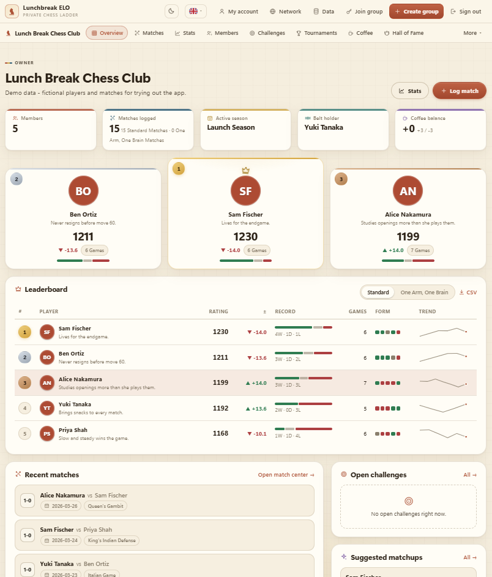
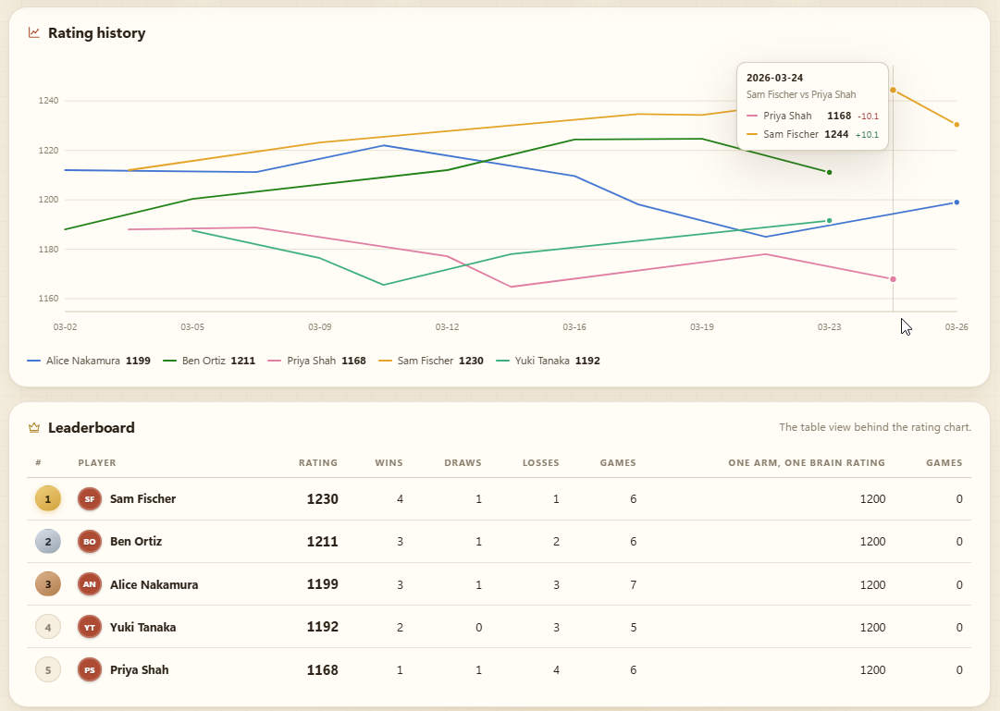
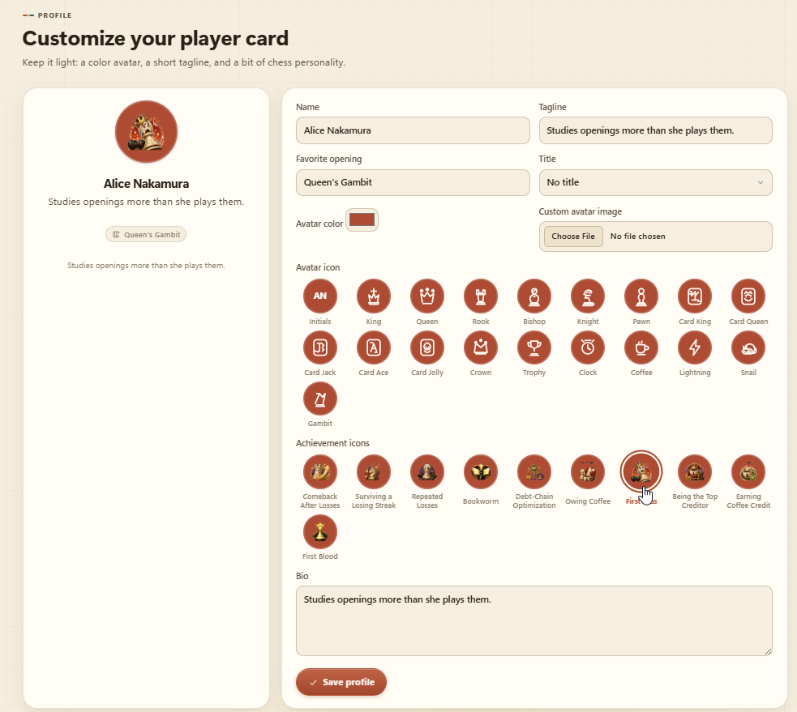
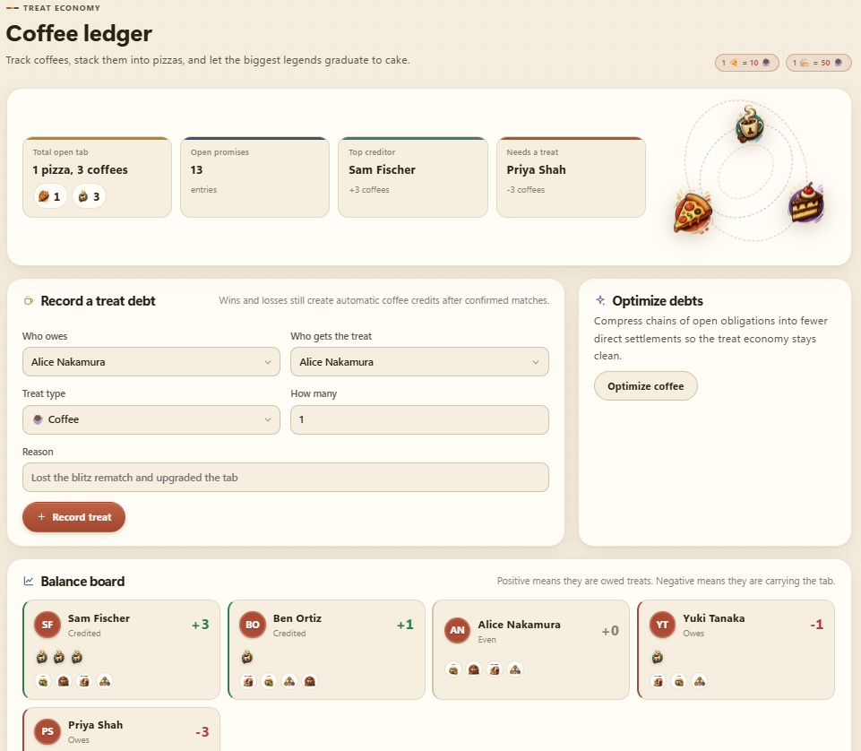

# Lunchbreak ELO

[](LICENSE)

A self-hosted, group-based chess ELO tracker. Built originally to settle lunch-break
chess arguments at work, it works just as well for any group of friends, a club, or a
gaming meetup: create personal accounts, join private groups by invite, customize a
player identity, log matches, run mini tournaments, track coffee bets, and export
standings without relying on spreadsheets.

## Screenshots

*(shown with the fictional demo data from [`demo-data/sample-snapshot.json`](demo-data/sample-snapshot.json))*

|     |     |
| --- | --- |
|  |  |
|  |  |

## Feature set

- Private, invite-code-only workspaces (optionally restricted by email domain)
- Match logging, editing, and deletion with automatic ELO recalculation
- Leaderboard with wins, draws, games played, and last rating movement
- Season support, including optional rating resets
- Rivalry and activity stats, head-to-head player comparisons
- Player profile customization with color avatars, taglines, bio, and favorite opening
- Match suggestions based on freshness and close ratings, plus a challenge system
- Tournament creation and tracking (Swiss, knockout, round-robin)
- "Braccio Mente" / One Arm, One Brain 2v2 team matches with their own separate ELO ladder
- King-of-the-hill style belt tracking
- Weekly missions, achievements, and team competitions
- Match confirmation workflow for player-submitted results
- PGN import/export and PGN storage on matches
- Coffee ledger for friendly side-bets, and a winner wall / hall of fame
- CSV exports for reporting or backup
- Four-language UI (English, Italian, French, Spanish)

## Stack

- Flask
- SQLite
- Jinja templates + custom CSS
- Pure Python ELO engine with full rating-history recalculation

## Quick start

```bash
python -m venv .venv
.venv\Scripts\activate
python -m pip install -r requirements.txt
python app.py
```

Open `http://127.0.0.1:5000`.

Copy [`.env.example`](.env.example) to `.env` to configure email sending and other local
settings before starting the app. Without a `SECRET_KEY` set, the app generates a
temporary one on each run — fine for trying it out, but set your own so logins survive a
restart. For a Gmail sender account, use a Gmail app password rather than your normal
account password.

Want to see it populated instead of a blank leaderboard? Log in, go to the in-app `Data`
page, and import [`demo-data/sample-snapshot.json`](demo-data/sample-snapshot.json) — a
small fictional dataset with a few players and matches.

## LAN / network mode

This app is designed to run from a single laptop or workstation that others reach over
the local network:

1. Start the app with `python app.py` (or `start-lan.bat` on Windows, which also creates
   the virtualenv and installs dependencies for you).
2. Open the in-app `Network` page to see the LAN and VPN addresses detected on the host.
3. Share a full invite link with the group, e.g. `http://YOUR-IP:5000/invite/<group-slug>/<invite-code>`.
4. Make sure your firewall allows inbound access on port `5000`.

The app binds to `0.0.0.0` by default when launched via `python app.py`.

## Default workflow

1. Create an account.
2. Create a group.
3. Open the group `Settings` page or the global `Network` page and copy a full invite link.
4. Let members join, customize their profiles, and start recording matches.
5. Use tournaments, matchup suggestions, and the coffee ledger to keep things lively.
6. For Braccio Mente / One Arm, One Brain matches, log the caller as `mente` and the
   teammate as `braccio` for each side — this ladder never touches the standard 1v1 ELO.

## Backups and handoff

Since this is meant to run from someone's own machine rather than a hosted server, there's
a built-in portability story instead of managed infrastructure:

- An owner/admin can download the current data as a JSON snapshot from the in-app `Data` page.
- Another host can clone the repo, start their own local copy, and import that snapshot
  from the same `Data` page to pick up where the previous host left off.
- Step-by-step host-to-host takeover instructions are in [handover.md](handover.md).
- Optionally, the app can write timestamped JSON backups to `data/snapshots/` on every
  change (`AUTO_SNAPSHOT_TO_REPO=1` in `.env`), and even git-commit them automatically
  (`AUTO_GIT_COMMIT=1`). Both are off by default — turn them on only if you understand
  they'll write your app's data, including player names and emails, into your git history.

## Optional Docker

```bash
docker compose up --build
```

This keeps the SQLite database and snapshots on mounted local folders.

## Useful commands

```bash
python -m flask --app app init-db
python -m unittest discover -s tests
```

## Contributing

Contributions are welcome — see [CONTRIBUTING.md](CONTRIBUTING.md) for how to set up a
dev environment, run the tests, and submit a pull request. Please also read the
[Code of Conduct](CODE_OF_CONDUCT.md). Found a security issue? See
[SECURITY.md](SECURITY.md) instead of opening a public issue.

## License

MIT — see [LICENSE](LICENSE).
